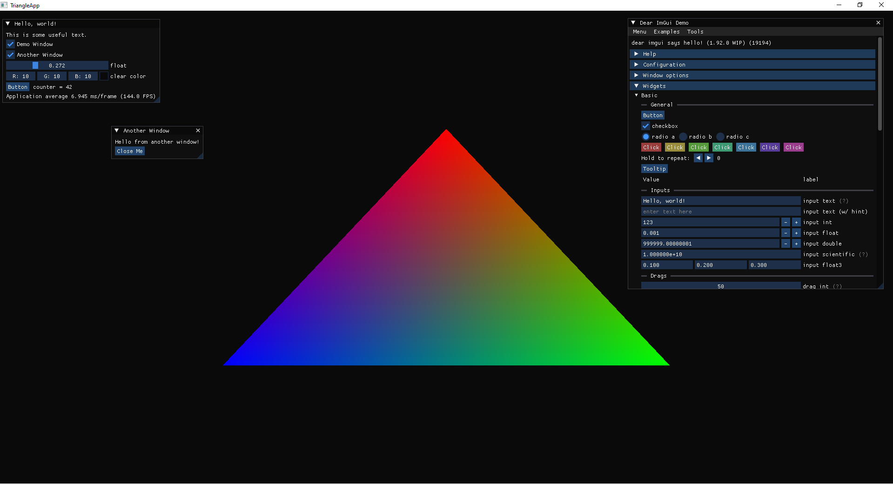

# C++ & OpenGL Template

This repository provides a template for starting C++ projects using OpenGL. It includes a small rudimentary abstraction layer over OpenGL. This is not meant to be a feature rich, robust, and flexible framework.

## Included Dependencies (as Submodules)

* **GLFW:** For window creation and input handling. [(link to Github)](https://github.com/glfw/glfw)

## Other Dependencies (Manual Setup Required)

* **GLAD:** OpenGL function loader. [(link to generator)](https://glad.dav1d.de/)
* **ImGui:** For immediate mode GUI. [(link to Github)](https://github.com/ocornut/imgui)

## Setup Instructions

Assuming you are on **Linux** (not tested on other platforms), follow these steps to set up the project on your local machine:

1.  **Clone the repository:**
    ```bash
    git clone --recursive (https://github.com/fatonhoti/CPP_OGL_TEMPL.git
    cd CPP_OGL_TEMPL
    ```
    The `--recursive` flag ensures that the relevant submodules (e.g., GLFW) are also cloned. If you've already cloned without it, you can initialize and update the submodules with:
    ```bash
    git submodule init
    git submodule update
    ```
    This should generate a `.gitmodules` files in the root folder.

2.  **Install CMake (if you haven't already):**
    You'll need CMake (only tested with version 3.15 or higher) to build the project.

    * **Linux (Debian/Ubuntu):**
        ```bash
        sudo apt update
        sudo apt install cmake
        ```

3.  **Set up GLAD:**
    GLAD needs to be generated for your specific OpenGL version. Follow these steps:
    * Go to the [GLAD Web Service](https://glad.dav1d.de/).
    * Ensure the **Language** is set to **C++**.
    * For **Specification**, select **OpenGL**.
    * In the **API** section, choose your desired OpenGL version (e.g., **4.6**) and the **Profile** (usually **Compatability**).
    * Ensure the **Extensions** you need are selected. By default none are selected.
    * Click the **Generate** button.
    * Create a directory named `glad` inside your project's `external` directory (`CPP_OGL_TEMPL/external/glad`).
    * Extract the contents of the `glad.zip` into the newly created `CPP_OGL_TEMPL/external/glad` directory. This should give you a structure like:
        ```bash
        CPP_OGL_TEMPL
            external
                glad/include/glad/glad.h
                glad/include/KHR/khrplatform.h
                glad/src/glad.c
            ...
        ```

4.  **Set up ImGUI** `imgui` is a header-only library.
    * Download/clone the `imgui` repo from its [GitHub repository](https://github.com/nothings/stb/blob/master/stb_image.h).
    * Place the downloaded/cloned repo inside your project's external folder (`CPP_OGL_TEMPL/external`).

5.  **Building:**
    * For a debug build run `./debug_build.sh`.
    * For a release build run `./rel_build.sh`.

6.  **Run the executable:**
    After a successful build, the executable will be located in the appropriate `build_*` directory, e.g., `build_release`. You can then run `./build_release/CPP_OGL_TEMPLATE` to run the program.

## Project Structure
```bash
CPP_OGL_TEMPL/
|── assets/
|   │── shaders/
│   │   ├── basic.vert
│   │   ├── basic.frag
├── external/
│   |── glad/      <-- GLAD stuff will go here
│   │   └── ...
│   ├── glfw/      <-- GLFW submodule
│   │   └── ...
│   └── imgui/     <-- ImGUI stuff will go here
│       └── ...
├── include/
|   │── Application.h
|   │── stb_image.h     <-- included by default when you use this template
│   ├── renderer/
│   │   ├── Buffer.h
│   │   ├── Shader.h
│   │   └── Texture.h
│   ├── input/
│   │   └── Input.h
├── src/
│   ├── main.cpp
│   ├── renderer/
│   │   ├── Buffer.cpp
│   │   ├── Shader.cpp
│   │   └── Texture.cpp
│   └── input/
│       └── Input.cpp
|── debug_build.sh
|── rel_build.sh
|── .gitmodules
|── CMakeLists.txt
|── .gitmodules
└── .gitignore

```

## Usage

This template provides a starting point with basic abstractions for:

* **OpenGL Objects:** `Texture`, `Buffer`, `Shader` classes in the `Renderer` namespace.
* **Input Handling:** Static functions in the `Input` namespace for keyboard and mouse input.
* **GUI:** Integrated ImGui library.

You can build upon these abstractions and add more functionality as needed for your projects.

## Contributing

Contributions to this template are welcome! If you have suggestions for improvements, bug fixes, or new features, please feel free to submit a pull request.

Here are some guidelines for contributing:

1.  **Fork the repository:** Start by creating your own fork of this repository.
2.  **Create a branch:** Make your changes in a separate branch, clearly named to reflect the purpose of your changes (e.g., `feature/new-abstraction`, `bugfix/shader-loading`).
3.  **Follow coding style:** Please try to adhere to a consistent coding style. While not strictly enforced, consistency helps maintain readability.
4.  **Submit a pull request:** Once you've made your changes and tested them thoroughly, submit a pull request to the main repository. Clearly describe the changes you've made and the reasoning behind them.
5.  **Be responsive:** Be prepared to respond to feedback and make adjustments to your pull request if necessary.

## License

At your own risk, the code in this template is yours to wield as you see fit.

---

